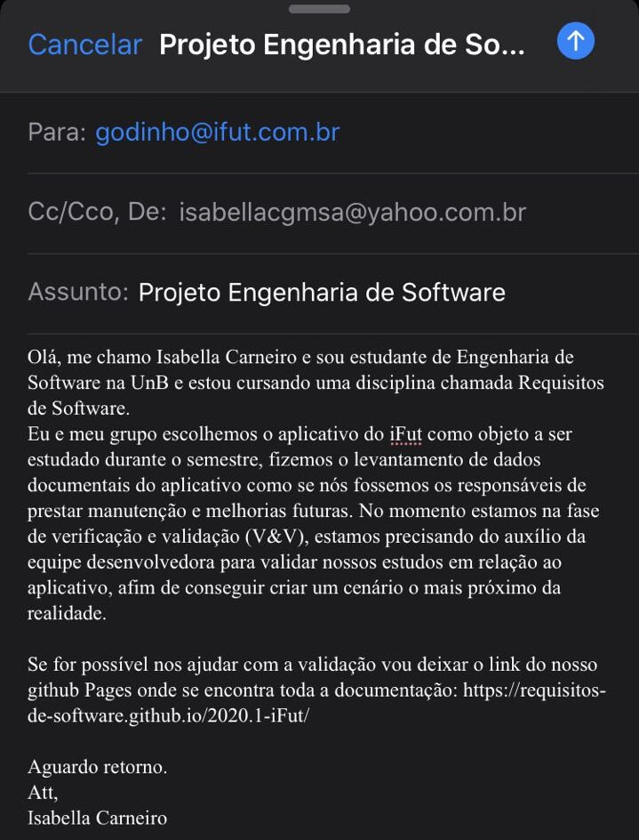
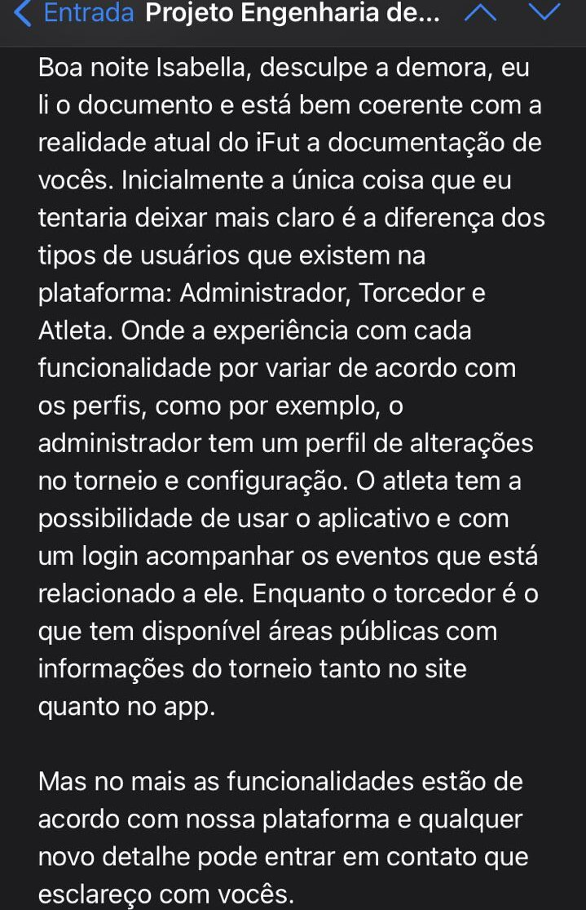

# Validação por Comprovação Informal
  
## Histórico de Versão
<table class="table table-striped border">
    <thead>
        <th>Data</th> 
        <th>Versão </th> 
        <th>Descrição</th> 
        <th>Autor(es)</th>
    </thead>
    <tbody>
        <tr>
            <td> 08.11.2020 </td>
            <td>  0.1   </td>
            <td> Criação do documento</td>
            <td> Isabella Carneiro </td>
        </tr>
		<tr>
            <td> 08.11.2020 </td>
            <td>  0.2   </td>
            <td> Adição do conteúdo</td>
            <td> Isabella Carneiro </td>
        </tr>
    </tbody>
</table>
 

## Validação Informal via e-mail

No dia 29 de outubro a integrante Isabella enviou o seguinte e-mail ao desenvolvedor do iFut Matheus Godinho:

Olá, me chamo Isabella Carneiro e sou estudante de Engenharia de Software na UnB e estou cursando uma disciplina chamada Requisitos de Software.
Eu e meu grupo escolhemos o aplicativo do iFut como objeto a ser estudado durante o semestre, fizemos o levantamento de dados documentais do aplicativo como se nós fossemos os responsáveis de prestar manutenção e melhorias futuras. No momento estamos na fase de verificação e validação (V&V), estamos precisando do auxílio da equipe desenvolvedora para validar nossos estudos em relação ao aplicativo, afim de conseguir criar um cenário o mais próximo da realidade.
Se for possível nos ajudar com a validação vou deixar o link do nosso github Pages onde se encontra toda a documentação: https://requisitos-de-software.github.io/2020.1-iFut/
Aguardo retorno.
Att, 
Isabella Carneiro

 

## Feedback

No dia 6 de novembro o grupo obteve a seguinte resposta:

Boa noite Isabella, desculpe a demora, eu li o documento e está bem coerente com a realidade atual do iFut a documentação de vocês. 
Inicialmente a única coisa que eu tentaria deixar mais claro é a diferença dos tipos de usuários que existem na plataforma: Administrador, Torcedor e Atleta. 
Onde a experiência com cada funcionalidade por variar de acordo com os perfis, como por exemplo, o administrador tem um perfil de alterações no torneio e configuração. 
O atleta tem a possibilidade de usar o aplicativo e com um login acompanhar os eventos que está relacionado a ele. Enquanto o torcedor é o que tem disponível áreas públicas com informações do torneio tanto no site quanto no app.
Mas no mais as funcionalidades estão de acordo com nossa plataforma e qualquer novo detalhe pode entrar em contato que esclareço com vocês. 

 

## Conclusão

O grupo ficou muito satisfeito com o retorno obtido pela empresa e com relação à diferenciação dos usuários será feito uma página em que se explica melhor o aplicativo e seus objetivos, e na mesma se encontrará os perfis de usuários para que não haja dúvidas.
