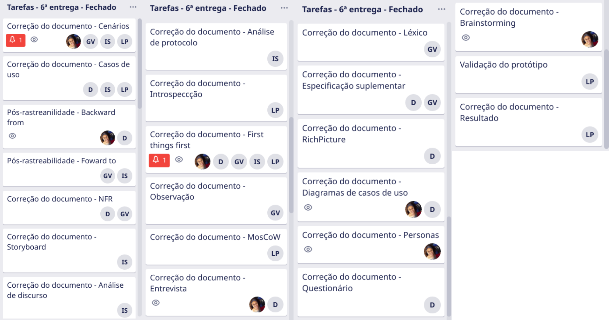

# 6ª entrega - Apresentação final
Realizado de 10/10 até 26/11

Para a nossa última entrega, foram desenvolvidos os documentos para a pós-rastreabilidade - backward-from e foward-from. Além disso, todos os documentos da fase de pré-rastreabilidade, elicitação e modelagem foram corrigidos com base nas observações das verificações.

 

## Vídeo da apresentação

<iframe width="820" height="500" src="https://www.youtube-nocookie.com/embed/sbwTUM0AHDo" frameborder="0"
    allow="accelerometer; autoplay; clipboard-write; encrypted-media; gyroscope; picture-in-picture"
    allowfullscreen></iframe>

 

## Slides da apresentação

<object data="../../images/Requisitos.pdf" type="application/pdf" width="820px" height="400px">
<embed src="../../images/Requisitos.pdf">
        
This browser does not support PDFs. Please download the PDF to view it: <a href="../../images/Requisitos.pdf">Download PDF</a>.

    </embed>
</object>

 

## Tarefas no Trello

