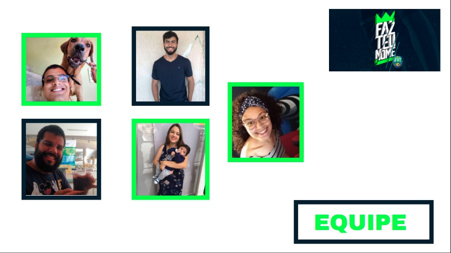
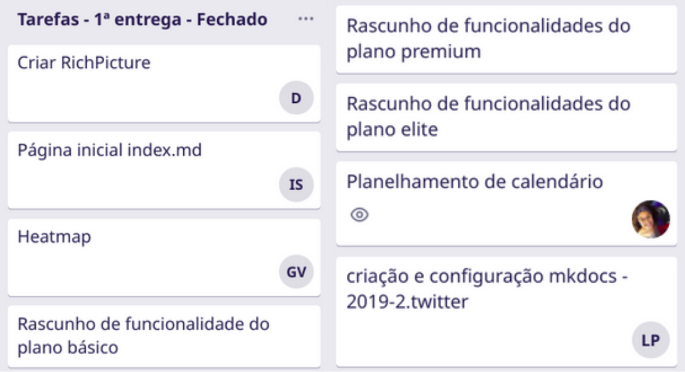

# 1ª entrega - Planejamento do projeto
Realizado de 18/08 até 07/09

Para a nossa primeira entrega, fizemos a escolha do aplicativo iFut para ser o objeto de estudo do projeto para a matéria de requisitos de software. Foram desenvolvidos o heatmap, a RichPicture inicial do app e a wiki do nosso projeto.

 

## Vídeo da apresentação

<iframe width="820" height="500" src="https://www.youtube-nocookie.com/embed/5ebnOhSN5ck?controls=0" frameborder="0"
    allow="accelerometer; autoplay; clipboard-write; encrypted-media; gyroscope; picture-in-picture"
    allowfullscreen></iframe>

## Slides da apresentação

 

## Tarefas no Trello

