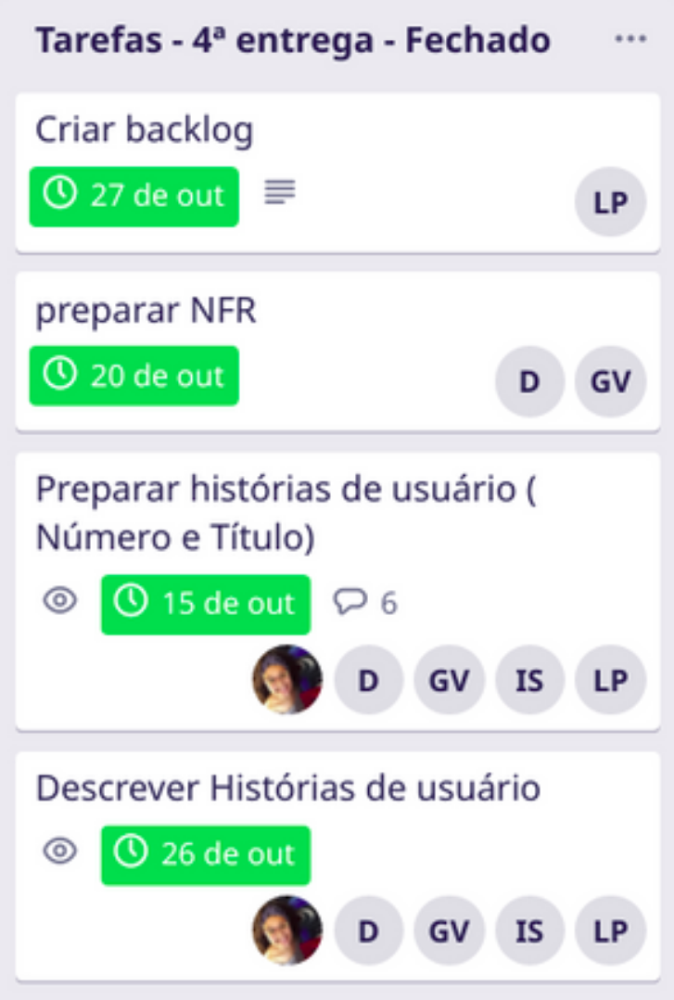

# 4ª entrega - Modelagem (Segunda parte)
Realizado de 10/10 até 28/10

Na quarta entrega foram desenvolvidos os últimos documentos para a conclusão da fase de modelagem. Nessa etapa, foram desenvolvidos o backlog, NFR, e as histórias de usuário.

 

## Vídeo da apresentação

<iframe width="820" height="500" src="https://www.youtube-nocookie.com/embed/xlrMEtLJnmg" frameborder="0"
    allow="accelerometer; autoplay; clipboard-write; encrypted-media; gyroscope; picture-in-picture"
    allowfullscreen></iframe>

 

## Tarefas no Trello

