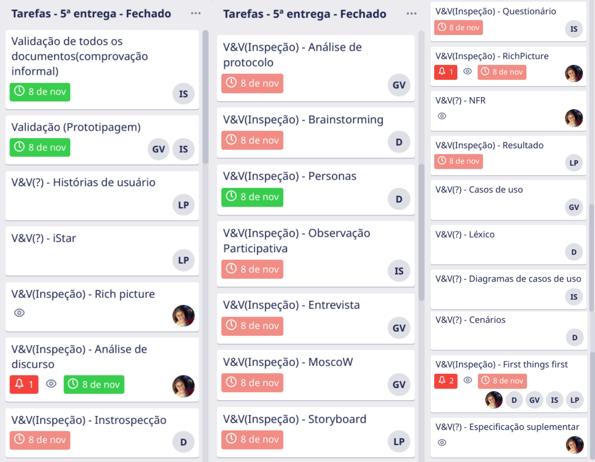

# 5ª entrega - Verificação e Validação
Realizado de 29/10 até 09/11

Nessa etapa os documentos de elicitação e modelagem passaram por uma verificação, por meio de inspeção. Além disso foram feitas a validações de todos os documentos e da prototipagem.

 

## Vídeo da apresentação

<iframe width="820" height="500" src="https://www.youtube-nocookie.com/embed/PYnOtLV5meo" frameborder="0"
    allow="accelerometer; autoplay; clipboard-write; encrypted-media; gyroscope; picture-in-picture"
    allowfullscreen></iframe>

 

## Tarefas no Trello

