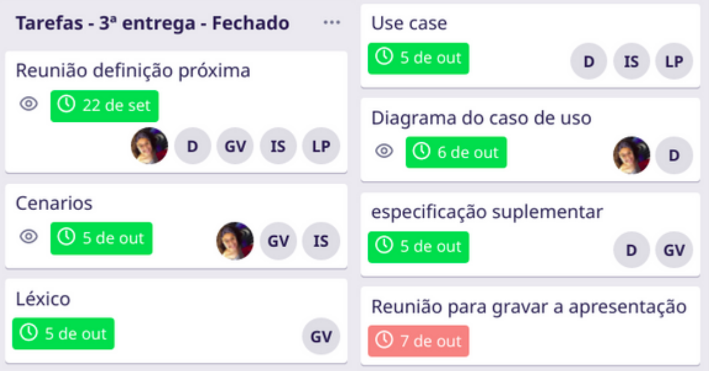

# 3ª entrega - Modelagem (Primeira parte)
Realizado de 15/09 até 09/10

Para a terceira entrega, deu-se início ao desenvolvimento dos documentos da fase de modelagem. Foram criados os cenários, léxicos, casos de uso e seus respectivos diagramas, e a especificação suplementar.

 

## Vídeo da apresentação

<iframe width="820" height="500" src="https://www.youtube.com/embed/qeZQvS0o2tI" frameborder="0"
    allow="accelerometer; autoplay; clipboard-write; encrypted-media; gyroscope; picture-in-picture"
    allowfullscreen></iframe>

 

## Tarefas no Trello

