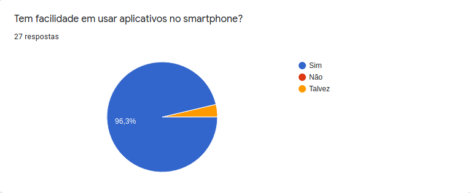
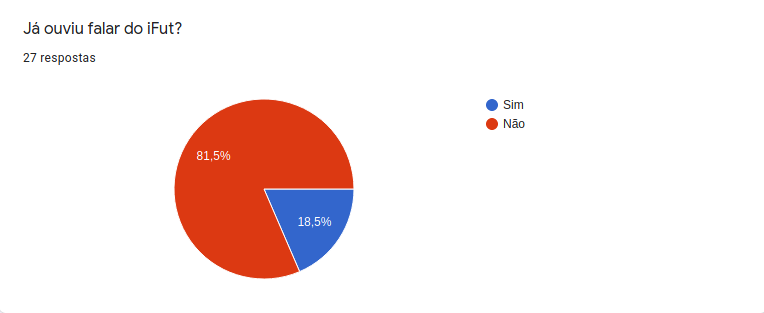
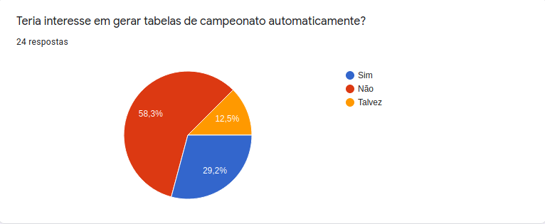
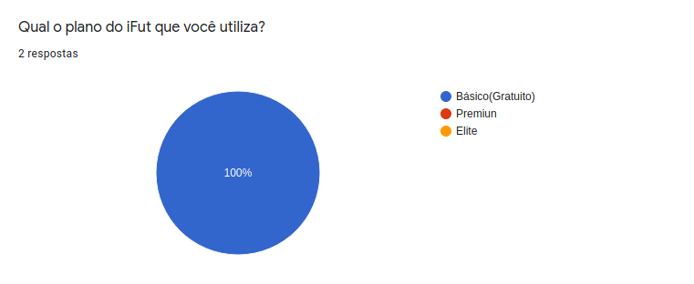
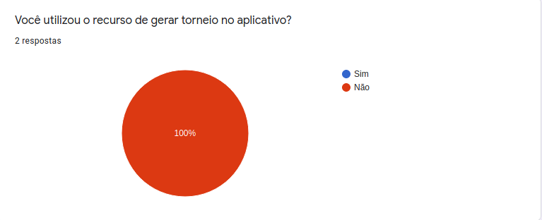
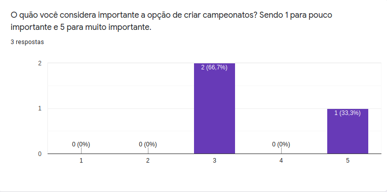
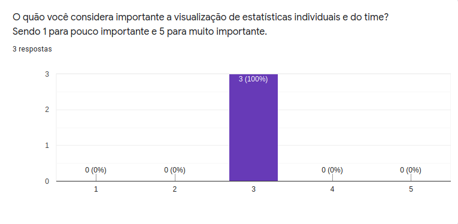

# **Questionário**

## Metodologia

 

    
&emsp;
      A técnica de Questionários consiste basicamente na elaboração de um conjunto de perguntas que irão guiar um stakeholder ou um grupo deles à respondê-las. Essa técnica não possui diretrizes bem definidas, mas existem recomendações diversas feitas por vários autores sobre como utilizar essa técnica para fazer o levantamento de requisitos.

    
&emsp;
      Alguns cuidados também podem ser tomados para potencializar o resultado de um questionário, como utilizar perguntas claras e objetivas. A maneira como as perguntas são dispostas também podem fazer a diferença nos resultados.

 

## Participantes

* Damarcones Porto

##  Resultado
### 1. Informações Gerais

	

         
    

	

         
    

	

         
    

	

         
    

	

         
    

### 2. Seção destinada para quem nunca usou o iFut

	

         
    

	

         
    

	

         
    

	

         
    

	

         
    

	

         
    

	

         
    

### Seção destinada para quem já utilizou o iFut

	

         
    

	

         
    

	

         
    

	

         
    

	

         
    

	

         
    

	

         
    

	

         
    

	

         
    

	

         
    

	

         
    

A partir dos resultados obtidos com o questionário, verificou-se que entre os usuários do aplicativo a funcionalidade de súmula automática é a mais importante e as funcionalidades de criar campeonato e visualização de estatísticas indivíduais são medianamente importantes. Além disso, baseando-se na quantidade de respostasde usuários que não usam o aplicativo, observa-se que há uma deficiência na visibilidade do aplicativo, visto que muitos nunca ouviram falar sobre o aplicativo iFut.