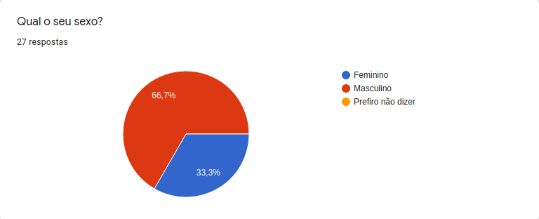
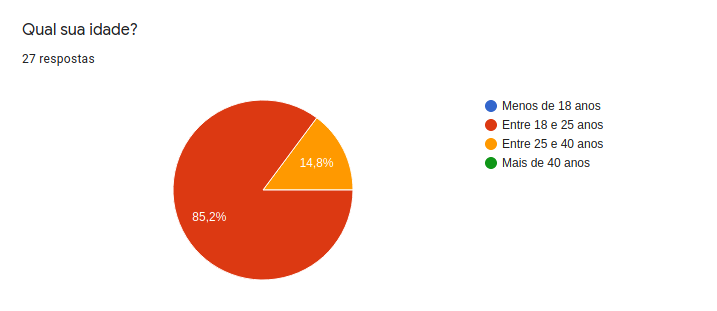
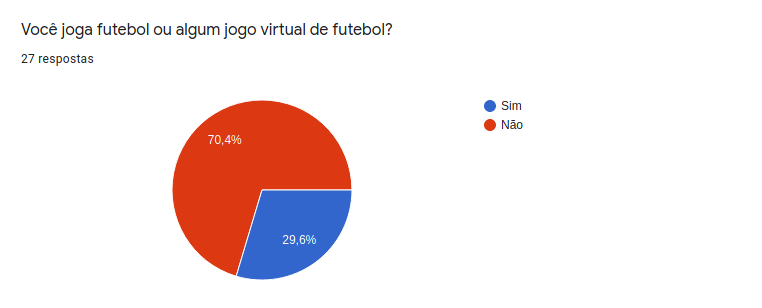
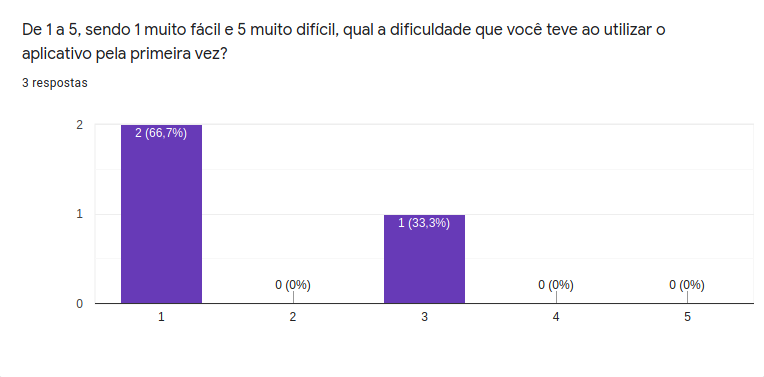
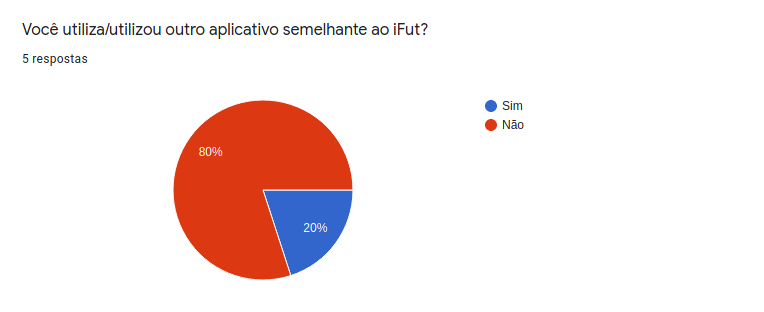
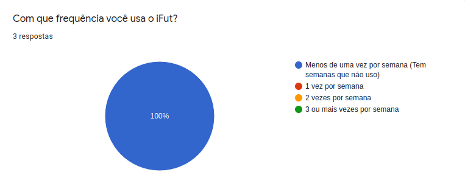
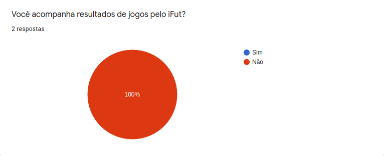

# **Questionário**

## Histórico de Versão
<table class="table table-striped border">
    <thead>
        <th>Data</th> 
        <th>Versão </th> 
        <th>Descrição</th> 
        <th>Autor(es)</th>
    </thead>
        <tbody>
        <tr>
            <td> 20.09.2020 </td>
            <td>  0.1   </td>
            <td> Adiciona Metodologia </td>
            <td> Bruna Almeida </td>
        </tr>
        <tr>
            <td> 25.09.2020 </td>
            <td>  0.2   </td>
            <td> Questionário </td>
            <td> Damarcones Porto </td>
        </tr>
         <tr>
            <td> 24.11.2020 </td>
            <td>  0.3   </td>
            <td> Revisão do documento </td>
            <td> Damarcones Porto </td>
        </tr>
    </tbody>
</table>

 

## Introdução

 

    
&emsp;
      A técnica de Questionários consiste basicamente na elaboração de um conjunto de perguntas que irão guiar um stakeholder ou um grupo deles à respondê-las. Essa técnica não possui diretrizes bem definidas, mas existem recomendações diversas feitas por vários autores sobre como utilizar essa técnica para fazer o levantamento de requisitos.

    
&emsp;
      Alguns cuidados também podem ser tomados para potencializar o resultado de um questionário, como utilizar perguntas claras e objetivas. A maneira como as perguntas são dispostas também podem fazer a diferença nos resultados.

 

## Participantes

* Damarcones Porto

##  Resultado
### 1. Informações Gerais

	

         
    

	

         
    

	

         
    

	

         
    

	

         
    

### 2. Seção destinada para quem nunca usou o iFut

	

         
    

	

         
    

	

         
    

	

         
    

	

         
    

	

         
    

	

         
    

### 3. Seção destinada para quem já utilizou o iFut

	

         
    

	

         
    

	

         
    

	

         
    

	

         
    

	

         
    

	

         
    

	

         
    

	

         
    

	

         
    

	

         
    

A partir dos resultados obtidos com o questionário, verificou-se que entre os  <a href="../../modelagem/lexico/#usuario">usuário</a>s do aplicativo a funcionalidade de súmula automática é a mais importante e as funcionalidades de criar <a href="../../modelagem/lexico/#campeonato">campeonato</a> e visualização de  <a href="../../modelagem/lexico/#estatisticas">estatísticas</a> indivíduais são medianamente importantes. Além disso, baseando-se na quantidade de respostas de  <a href="../../modelagem/lexico/#usuario">usuário</a>s que não usam o aplicativo, observa-se que há uma deficiência na visibilidade do aplicativo, visto que muitos nunca ouviram falar sobre o aplicativo iFut.

<table class="table table-striped border" style="color:black;">
    <thead style="background-color: #00ff2b;">
        <th>Número</th>
        <th>Requisito</th>
    </thead>
    <tbody>
        <tr>
            <td>1  </td> <td>O  <a href="../../modelagem/lexico/#usuario">usuário</a> deve poder gerar súmulas automáticamente</td>
        </tr>
        <tr>
            <td>2  </td> <td>O  <a href="../../modelagem/lexico/#usuario">usuário</a> deve poder ver  <a href="../../modelagem/lexico/#estatisticas">estatísticas</a> de jogadores e do  <a href="../../modelagem/lexico/#time">time</a></td>
        </tr>
        <tr>
            <td>3  </td> <td>O  <a href="../../modelagem/lexico/#usuario">usuário</a> deve poder criar <a href="../../modelagem/lexico/#campeonato">campeonato</a>s</td>
        </tr>
    </tbody>
</table>

 

## Referências
- Livro:Vasquez,C. E.;Simões, G. S. Engenharia de Requisitos. BRASPORT; 1ª edição (19 outubro 2016).