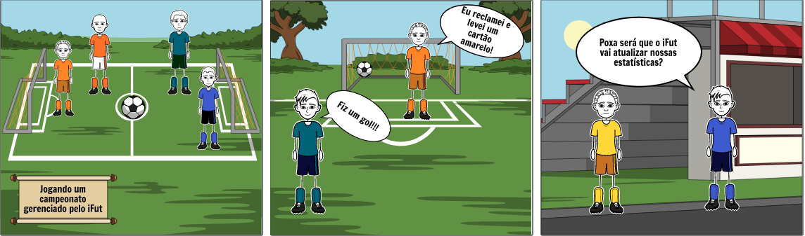

# **Storytelling**

## Metodologia

 

    
&emsp;
        Como um campo de pesquisa interdisciplinar, a narração de histórias (Storytelling), no campo de elicitação de requisitos, consiste na criação de histórias interativas, concepção de contextos flexíveis de histórias e desenhos de um processo de tomada de decisão para resultados dinâmicos casuais de histórias.

    
&emsp;
        Em comparação com a estrutura tradicionalmente linear e baseada na conversação, o storytelling não apenas traz mais variações (enredos ou resultados) no desenvolvimento de histórias, mas também dá ao stakeholder mais espaço livre para a imaginação e criatividade.

    

        <em>(Shen, 2010) / (Stapleton et al., 2002)</em>

    

        <em></em>

 

## Participantes

- Isabella Carneiro

##  Resultado

 

 

<table class="table table-striped" style="color:black;">
    <thead style="background-color: #00ff2b;">
        <th>Número</th>
        <th>Requisito</th>
    </thead>
    <tbody>
        <tr>
            <td>1      </td> <td>O usuário deve ser capaz de visualizar a sua agenda de jogos.    </td>
        </tr>
        <tr>
            <td>2      </td> <td>O sistema deve atualizar a agenda de jogos com base nos campeonatos do usuário.         </td>
        </tr>
        <tr>
            <td>3      </td> <td>O usuário deve ser capaz de visualizar suas estatísticas após os jogos.                                              </td>
        </tr>
        <tr>
            <td>4      </td> <td>O sistema deve atualizar constantemente as estatísticas dos jogadores.                                  </td>
        </tr>
        </tbody>
</table>

