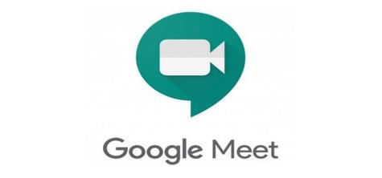
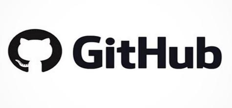

# 2020.1-iFut 

## Sobre o Projeto

 Repositório destinado à disciplina de Requisitos de Software sobre o aplicativo iFut. Serão documentados os métodos e técnicas para levantamento e especificação de requisitos da aplicação selecionada.

## Sobre o aplicativo

 O iFut é um gerenciador de campeonatos que facilita o planejamento de torneios de futebol. O app planeja todas as etapas de campeonatos de futebol, como inscrições, criação de tabelas e rodadas, além de oferecer uma opção de gameficação que gera engajamento dos usuários na plataforma online. 

## Equipe

    

    

            
        

        

            
        

        

            
        

        

            
        

        

            
        

    
  

 

## Ferramentas 

	

		
		
O Google Drive será utilizado pela equipe para a realização de documentos em conjunto.

	

	

		
		
O Google Meet será utilizado para a realização de reuniões e atividades em conjunto.

	

	

		
		
O Google Calendar será utilizado para o planejamento dos horários dos membros do grupo.

	

	

		
		
O Github será utilizado para o versionamento e armazenamento de todos os documentos que serão produzidos pelo grupo.

	

	

		
		
O Telegram será utilizado para a facilitar a comunicação entre os membros do grupo.

	

	

		
		
O Trello será utilizado para a organização e planejamento do grupo.

	

