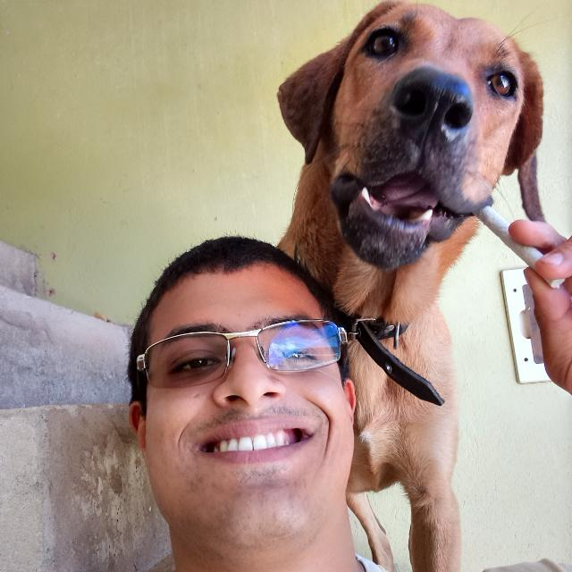

# 2020.1-iFut

## Sobre o Projeto

 Repositório destinado à disciplina de Requisitos de Software sobre o aplicativo iFut. Serão
	documentados os métodos e técnicas para levantamento e especificação de requisitos da aplicação selecionada.

## Sobre o aplicativo

 O iFut é um gerenciador de campeonatos que facilita o planejamento de torneios de futebol. O app
	planeja todas as etapas de campeonatos de futebol, como inscrições, criação de tabelas e rodadas, além de oferecer
	uma opção de gameficação que gera engajamento dos usuários na plataforma online. 

	
Esse aplicativo possui três tipos de usuários que se diferenciam pelas funcionalidades que eles utilizam: administrador, torcedor ou atleta. o administrador tem um perfil que permite realizar alterações no torneio e configuração do mesmo. O atleta tem a possibilidade de usar o aplicativo e com um login acompanhar os eventos que estão relacionados a ele, além de acompanhar sua própria estatística nos campeonatos que participa. O torcedor é o que tem disponível áreas públicas com informações de torneios tanto no site quanto no app.

## Equipe

	

		

			
		

		

			
		

		

			
		

	

	

		

			
		

		

			
		

	

 

## Ferramentas

	

		

			
			
O Google Drive será utilizado pela equipe para a realização de documentos em conjunto.

		

		

			
			
O Google Meet será utilizado para a realização de reuniões e atividades em conjunto.

		

		

			
			
O Google Calendar será utilizado para o planejamento dos horários dos membros do grupo.

		

	

	

		

			
			
O Github será utilizado para o versionamento e armazenamento de todos os documentos que serão produzidos
				pelo grupo.

			

			

				
				
O Telegram será utilizado para a facilitar a comunicação entre os membros do grupo.

			

			

				
				
O Trello será utilizado para a organização e planejamento do grupo.

			

	

