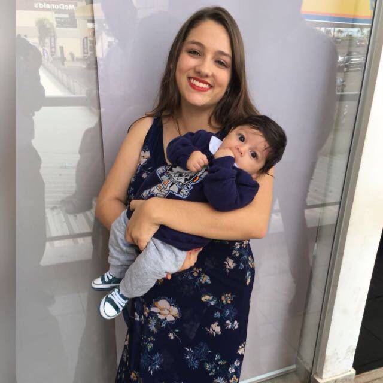

# 2020.1-iFut 

## Sobre o Projeto

 Repositório destinado à disciplina de Requisitos de Software sobre o aplicativo iFut. Serão documentados os métodos e técnicas para levantamento e especificação de requisitos da aplicação selecionada.

## Sobre o aplicativo

 O iFut é um gerenciador de campeonatos que facilita o planejamento de torneios de futebol. O app planeja todas as etapas de campeonatos de futebol, como inscrições, criação de tabelas e rodadas, além de oferecer uma opção de gameficação que gera engajamento dos usuários na plataforma online. 

## Equipe

| Nome | Matrícula | GitHub |&#128512;|
| --- | --- | --- | --- |
| Bruna Almeida Santos | 17/0100626 | brunaalmeidasantos | |
| Damarcones dos Santos Duque Porto | 15/0122187 | damarcones |  |
| Geraldo Victor Alves Barbosa | 17/0011119  | geraldovictor |  |
| Isabella Carneiro Godinho de Morais Sá | 18/0019066  | isabellacgmsa |   |
| Lucas Lopes Pereira | 15/0137290  | LucasPLopes |  |
