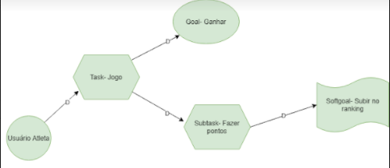

# iStar (i*)

## Histórico de Versão
<table class="table table-striped border">
    <thead>
        <th>Data</th> 
        <th>Versão </th> 
        <th>Descrição</th> 
        <th>Autor(es)</th>
    </thead>
    <tbody>
        <tr>
            <td> 27.10.2020 </td>
            <td>  0.1   </td>
            <td> Criação do documento</td>
            <td> Isabella Carneiro </td>
        </tr>
        <tr>
            <td> 23.11.2020 </td>
            <td>  0.2   </td>
            <td> Revisão do documento</td>
            <td> Isabella Carneiro </td>
        </tr>
    </tbody>
</table>

## Metodologia

A linguagem de modelagem i* foi introduzida para preencher a lacuna no espectro das linguagens de modelagem conceitual, com foco nas dimensões intencionais (por quê?), Sociais (quem?) E estratégicas (como? De que outra forma?).

## Resultado

A partir da notação gráfica do i* foram desenvolvidos dois diagramas utilizando o <a href="../../modelagem/lexico/#framework">framework</a> , visando facilitar a visualização das relações entre os atores.

### Diagrama de usuário atleta

 

### Diagrama de usuário técnico

 

## Referências
- Disponível em: http://istarwiki.org/tiki-index.php?page=iStarQuickGuide
