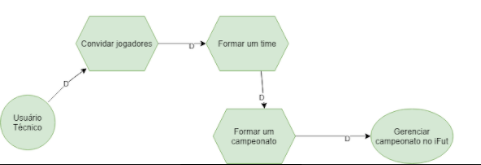

# iStar (i*)

## Histórico de Versão
<table class="table table-striped border">
    <thead>
        <th>Data</th> 
        <th>Versão </th> 
        <th>Descrição</th> 
        <th>Autor(es)</th>
    </thead>
    <tbody>
        <tr>
            <td> 27.10.2020 </td>
            <td>  0.1   </td>
            <td> Criação do documento</td>
            <td> Isabella Carneiro </td>
        </tr>
    </tbody>
</table>

## Diagrama de usuário atleta

 

## Diagrama de usuário técnico

 
