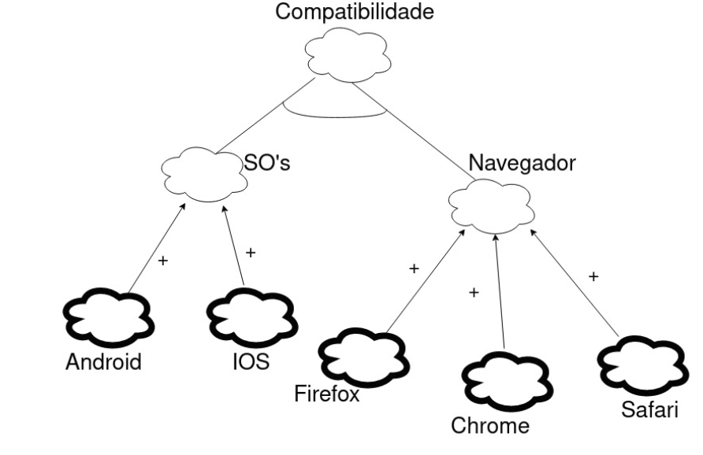
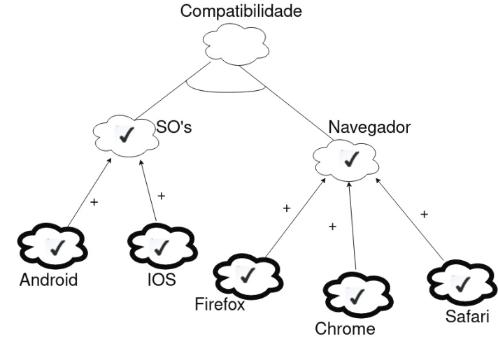
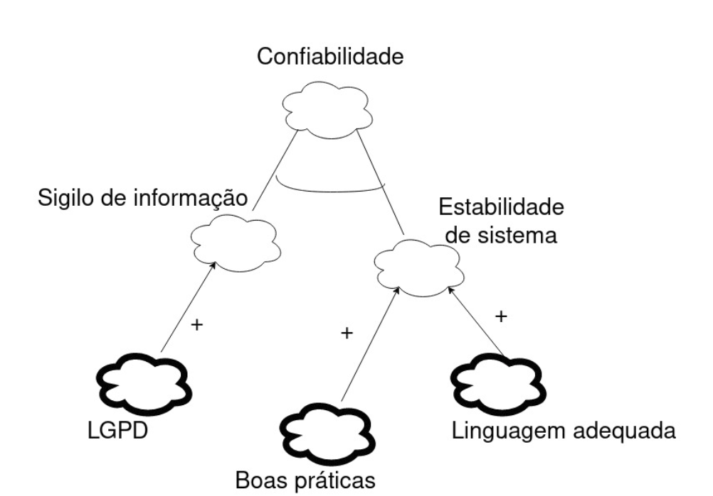
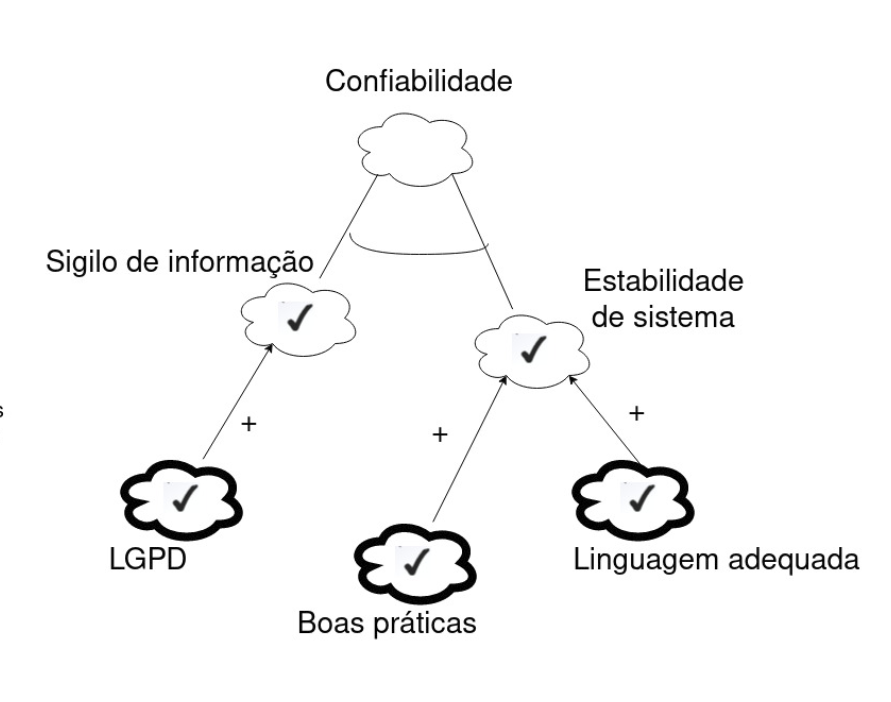

# NFR

 

## Histórico de Versão
<table class="table table-striped border">
    <thead>
        <th>Data</th> 
        <th>Versão </th> 
        <th>Descrição</th> 
        <th>Autor(es)</th>
    </thead>
    <tbody>
        <tr>
            <td> 28.10.2020 </td>
            <td>  0.1   </td>
            <td> Criação do documento</td>
            <td> Geraldo Victor, Damarcones</td>
        </tr>
        <tr>
            <td> 24.11.2020 </td>
            <td>  0.2   </td>
            <td>Revisão do documento</td>
            <td>Bruna, Damarcones</td>
        </tr>
    </tbody>
</table>

 

## Definição

&emsp;O NFR Framework é uma abordagem orientada a processos, que procura tornar explicitas as metas a serem atingidas para que se obtenha sucesso na implementação de um requisito não funcional. É representado pelo SIG (Softgoal interdependency graph) que descreve como os softgoals são decompostos.

 

### Participantes

* Geraldo Victor
* Damarcones

### Legenda

 

# **Compartibilidade**
## Sem propagação

## Com propagação

# **Confiabilidade**
## Com propagação

## Sem propagação

# **Usabilidade**
## Sem propagação

## Com propagação

 

## Referências

- Livro: SOMMERVILLE, Ian. Engenharia de Software. 9a edição, São Paulo: Pearson, 2011.