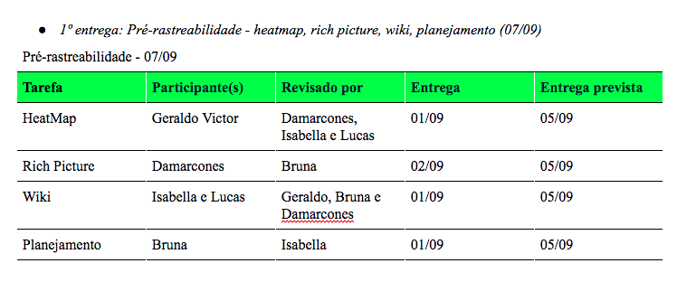

# Planejamento

## Heatmap

    
O Heatmap é uma excelente maneira de mapear quais são os dias da semana e o horário em que
    existe maior disponibilidade das pessoas, essa tabela mostra quantas pessoas estão disponíveis
    em cada dia e cada horário da semana. A tabela completa com a disponibilidade individual
    está disponível no 
    <a href="https://drive.google.com/file/d/1qLFhZfYWXNsZwYyI5h3kQEtI_x1UC-j5/view?usp=sharing"> Drive</a>.

# Cronograma

#### Realizado de 18/08 até 07/09

#### Realizado de 08/09 até 28/09

#### Realizado de 15/09 até 09/10

