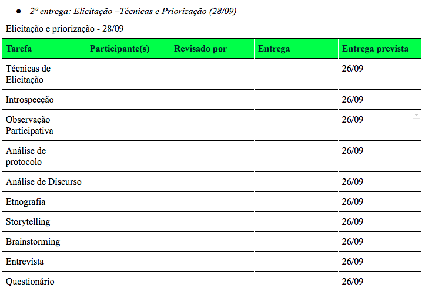
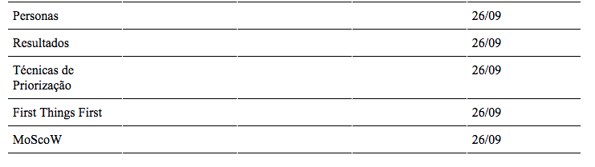
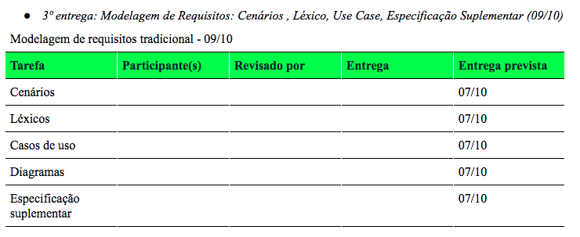

# Planejamento

## Heatmap

O Heatmap é uma excelente maneira de mapear quais são os dias da semana e o horário em que
    existe maior disponibilidade das pessoas, essa tabela mostra quantas pessoas estão disponíveis
    em cada dia e cada horário da semana. A tabela completa com a disponibilidade individual
    está disponível no
    <a href="https://drive.google.com/file/d/1qLFhZfYWXNsZwYyI5h3kQEtI_x1UC-j5/view?usp=sharing"> Drive</a>.

# Cronograma

* Realizado de 18/08 até 07/09

<table class="table table-striped" style="color:black;">
    <thead style="background-color: #00ff2b;">
        <th>Tarefa</th>
        <th>Participante(s)</th>
        <th>Revisor(es)</th>
        <th>Entrega</th>
        <th>Prevista</th>
    </thead>
    <tbody>
        <tr>
            <td>HeatMap</td>
            <td>Geraldo</td>
            <td>Damarcones, Isabella e Lucas</td>
            <td>01/09</td>
            <td>05/09</td>
        </tr>
        <tr>
            <td>Rich Picture</td>
            <td>Damarcones</td>
            <td>Bruna</td>
            <td>02/09</td>
            <td>05/09</td>
        </tr>
        <tr>
            <td>Wiki</td>
            <td>Isabella e Lucas</td>
            <td>Bruna, Damarcones e Geraldo</td>
            <td>01/09</td>
            <td>05/09</td>
        </tr>
        <tr>
            <td>Planejamento</td>
            <td>Bruna</td>
            <td>Isabella</td>
            <td>01/09</td>
            <td>05/09</td>
        </tr>
    </tbody>
</table>

#### Realizado de 08/09 até 28/09

#### Realizado de 15/09 até 09/10

