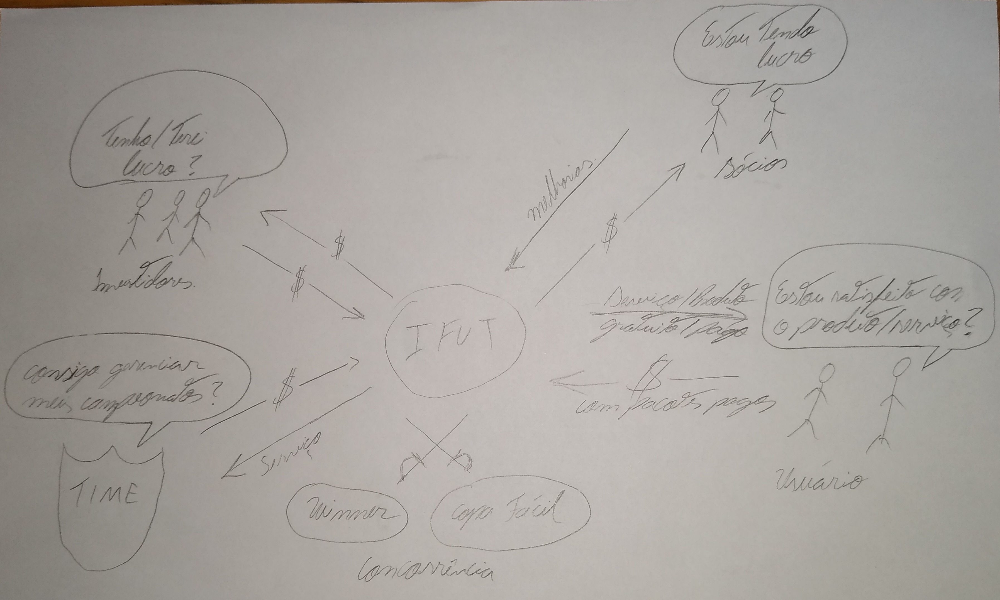
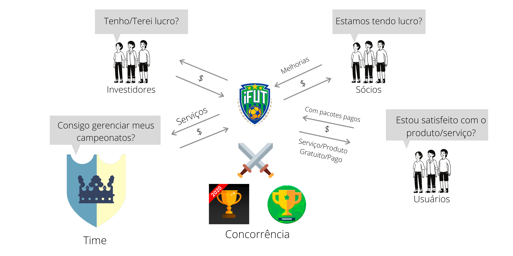

# Rich Pictures

 

## Histórico de Versão
<table class="table table-striped border">
    <thead>
        <th>Data</th> 
        <th>Versão </th> 
        <th>Descrição</th> 
        <th>Autor(es)</th>
    </thead>
    <tbody>
        <tr>
            <td> 02.09.2020 </td>
            <td>  0.1   </td>
            <td> Rich Picture Visão Geral V0 </td>
            <td> Damarcones Porto </td>
        </tr>
        <tr>
            <td> 23.09.2020 </td>
            <td>  0.2   </td>
            <td>  Rich Picture Visão Geral V1 </td>
            <td> Damarcones Porto </td>
        </tr>
    </tbody>
</table>

É o desenho de uma situação que ilustra os principais elementos e relações que precisam ser considerados em um software. É composto por imagens, textos, símbolos e ícones, todos usados ​​para ilustrar graficamente a situação. É chamada de rich picture porque ilustra a riqueza e a complexidade de uma situação.

## Rich Picture Visão Geral V0; 

    

            </a>
    

 

## Rich Picture Visão Geral V1; 

    

            </a>
    

 

